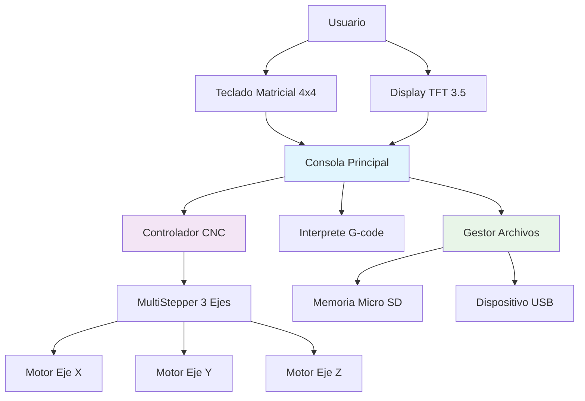
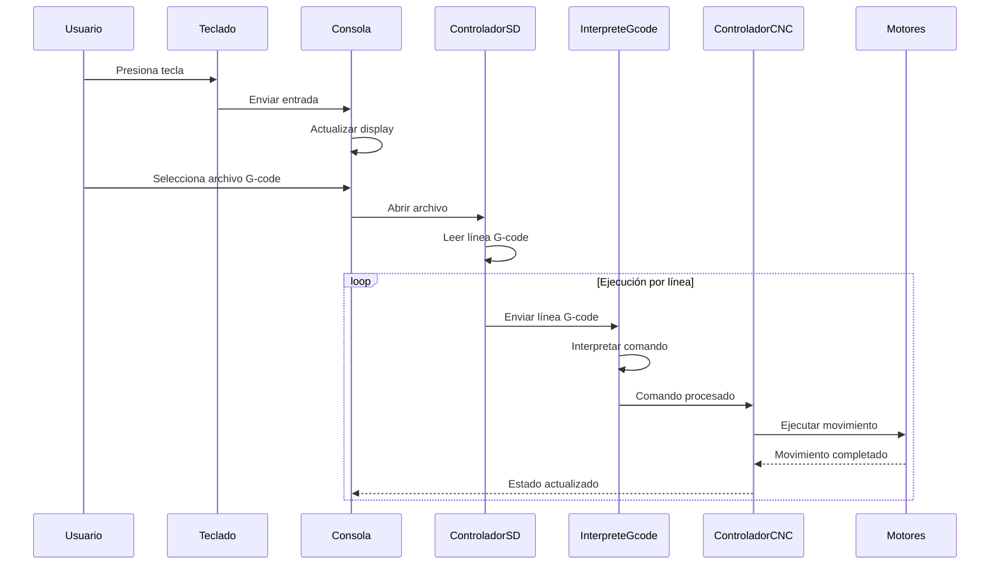
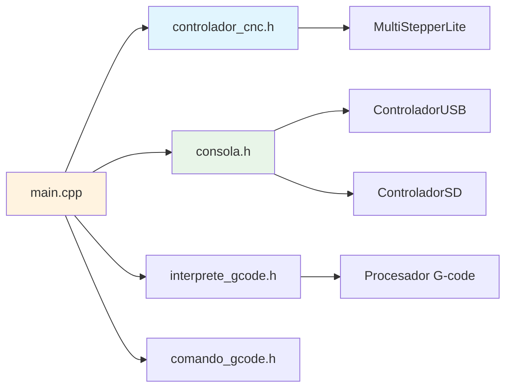

# CNCETI


Sistema de control completo para máquina CNC de 3 ejes con interfaz de usuario integrada, soporte para almacenamiento externo y procesamiento de archivos G-code.

---

## Características Principales

### Control de Movimiento
- **Control preciso de 3 ejes** (X, Y, Z) mediante steppers
- **Interpolación de movimientos** con MultiStepper
- **Procesamiento en tiempo real** de comandos G-code

### Interfaz de Usuario
- **Pantalla TFT 3.5 pulgadas** para visualización de estado
- **Teclado matricial 4x4** para control manual
- **Consola integrada** con información en tiempo real

### Almacenamiento y Archivos
- **Soporte para Micro SD** lectura de archivos G-code
- **Conexión USB** con sistema de archivos FAT
- **Gestión de archivos** G-code extensivos

### Procesamiento G-code
- **Intérprete completo** de comandos G-code
- **Ejecución secuencial** de instrucciones
- **Buffer de comandos** para procesamiento fluido

---

## Diagrama de Arquitectura del Sistema



---

## Estructura del Hardware

### Componentes Principales
- **Microcontrolador**: Arduino compatible
- **Display**: TFT 3.5 pulgadas con interfaz SPI
- **Teclado**: Matricial 4x4 personalizado
- **Drivers**: Controladores de stepper motors
- **Almacenamiento**: Lector Micro SD + Controlador USB CH376

### Conexiones de Pines
```cpp
// Configuración en pines.h
/**
 * DISPLAY PINES 22 - 41 
 * Referencia: "http://www.rinkydinkelectronics.com/files/UTFT_Requirements.pdf"
 * COMUNICACION SPI PARA TARJETA SD PINES 49 - 52
 * COMUNICACION SERIAL UART PAR USB PINES 16 - 17
 */
#define PIN_CHIP_SELECT_SD 49

#define PIN_MOTOR_X_PUL 62
#define PIN_MOTOR_X_DIR 63
#define PIN_MOTOR_X_EN 61
#define PIN_MOTOR_Y_PUL 60
#define PIN_MOTOR_Y_DIR 59
#define PIN_MOTOR_Y_EN 58
#define PIN_MOTOR_Z_PUL 57
#define PIN_MOTOR_Z_DIR 56
#define PIN_MOTOR_Z_EN 55


#define PIN_TECLADO_FILA_1 2
#define PIN_TECLADO_FILA_2 3
#define PIN_TECLADO_FILA_3 4
#define PIN_TECLADO_FILA_4 5

#define PIN_TECLADO_COL_1 6
#define PIN_TECLADO_COL_2 7
#define PIN_TECLADO_COL_3 8
#define PIN_TECLADO_COL_4 9

```

---

## Flujo de Operación



---

## Instalación y Configuración

### Requisitos del Sistema

**Hardware:**
- Placa Arduino Mega compatible
- Display TFT 3.5"
- Teclado matricial 4x4
- Módulo Micro SD
- Controlador USB CH376
- Drivers de motores a pasos

**Software:**
- Visual Studio Code
- Extension de PlatformIO para VS Code
- Librerías requeridas:
  - `Ch376msc.h` (Controlador USB)
  - `MultiStepperLite.h` (Control de motores)
  - `Keypad.h` (Manejo de teclado)

### Configuración Inicial

1. **Conectar el hardware** según la especificación de pines
2. **Cargar las librerías** necesarias en el IDE Arduino
3. **Compilar y subir** el sketch al microcontrolador
4. **Inicializar el sistema** mediante el teclado

---

## Uso del Sistema

### Navegación por Menú
- **Teclas numéricas**: Navegación y entrada de datos
- **Tecla A**: Función específica 1
- **Tecla B**: Función específica 2  
- **Tecla C**: Función específica 3
- **Tecla D**: Función específica 4
- **Tecla ***: Limpiar buffer/acción especial
- **Tecla #**: Confirmar/acción especial

### Operación con Archivos G-code

1. **Seleccionar medio de almacenamiento** (SD o USB)
2. **Navegar al archivo G-code deseado**
3. **Cargar y validar el archivo**
4. **Iniciar ejecución** desde el menú principal
5. **Monitorear progreso** en display TFT

---

## Estructura de Código

### Módulos Principales



### Archivos de Cabeza Principales

- **`pines.h`**: Definición de pines y conexiones
- **`constantes.h`**: Constantes y configuraciones del sistema
- **`controlador_usb.h`**: Manejo de dispositivos USB
- **`consola.h`**: Interfaz de usuario y display
- **`interprete_gcode.h`**: Procesamiento de comandos G-code
- **`controlador_cnc.h`**: Control central de la máquina CNC
- **`comando_gcode.h`**: Estructura de datos para comandos

---

## Especificaciones Técnicas

### Control de Movimiento
- **Resolución**: Configurable por steps/mm (Predefinida: 80mm)
- **Velocidad máxima**: Dependiente de drivers y motores
- **Aceleración**: Controlada por software

### Procesamiento G-code
- **Comandos soportados**: G0, G1, G2, G3, etc.
- **Parámetros**: X, Y, Z, F, S, M
- **Buffer de línea**: 256 caracteres

---

## Modo Desarrollador

El sistema incluye un modo de desarrollo para debugging:

```cpp
#define MODO_DESARROLLADOR  // Habilitar modo desarrollo
```

**Características del modo desarrollo:**
- Logging detallado por puerto serial
- Monitoreo de estado interno
- Diagnóstico de errores
- Información de depuración

---

## Solución de Problemas

### Problemas Comunes

1. **Archivos G-code no detectados**
   - Verificar formato FAT en memorias
   - Confirmar conexión de módulos SD/USB

2. **Movimiento errático de ejes**
   - Revisar configuración de pines
   - Verificar alimentación de motores

3. **Display no responde**
   - Confirmar conexiones SPI
   - Verificar inicialización de pantalla

### Logs de Diagnóstico

En modo desarrollador, el sistema proporciona información detallada:
- Estado de teclado
- Procesamiento de líneas G-code
- Ejecución de comandos CNC
- Errores de sistema

---

## Licencia

Este proyecto está bajo licencia MIT. Ver archivo `LICENSE` para más detalles.


---


## Licencia

Este proyecto está bajo la licencia **Creative Commons Attribution 4.0 International (CC BY 4.0)**. 
Eres libre de:
- Compartir — copiar y redistribuir el material en cualquier medio o formato
- Adaptar — remezclar, transformar y construir upon el material para cualquier propósito

Bajo los siguientes términos:
- **Atribución** — Debes dar crédito apropiado, proporcionar un enlace a la licencia, 
  e indicar si se realizaron cambios.

Consulta la licencia completa en: https://creativecommons.org/licenses/by/4.0/

---

**Desarrollado para el control de máquinas CNC de 3 ejes con interfaz de usuario integrada**