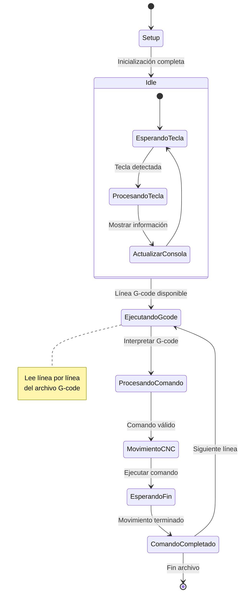

```mermaid
stateDiagram-v2
    [*] --> Setup
    Setup --> Idle: Inicialización completa
    
    state Idle {
        [*] --> EsperandoTecla
        EsperandoTecla --> ProcesandoTecla : Tecla detectada
        ProcesandoTecla --> ActualizarConsola : Mostrar información
        ActualizarConsola --> EsperandoTecla
    }
    
    Idle --> EjecutandoGcode : Línea G-code disponible
    EjecutandoGcode --> ProcesandoComando : Interpretar G-code
    ProcesandoComando --> MovimientoCNC : Comando válido
    MovimientoCNC --> EsperandoFin : Ejecutar comando
    
    EsperandoFin --> ComandoCompletado : Movimiento terminado
    ComandoCompletado --> EjecutandoGcode : Siguiente línea
    ComandoCompletado --> [*] : Fin archivo
    
    note right of EjecutandoGcode
        Lee línea por línea
        del archivo G-code
    end note

    
```